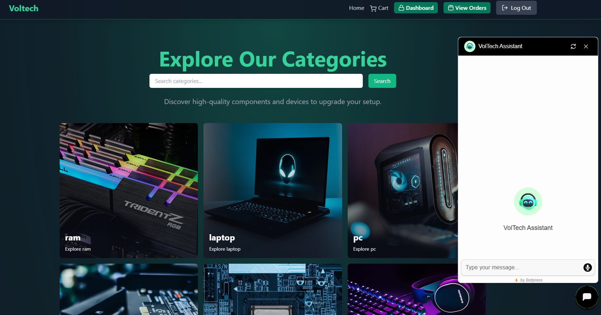

# Laptop E-commerce Website

## Overview
This project is a laptop-selling website built using the MERN stack. It provides a dynamic, user-friendly platform for customers to browse, filter, and purchase laptops online. Additionally, it offers an admin panel for efficient management of products, orders, and revenue statistics.

## Technologies Used
The project utilizes modern web development technologies to ensure scalability, performance, and maintainability:

### MERN Stack
1. **MongoDB**: NoSQL database for flexible and scalable data storage.
2. **Express.js**: Back-end framework for building RESTful APIs.
3. **React.js**: Front-end library for creating dynamic, responsive user interfaces.
4. **Node.js**: Runtime environment for executing server-side JavaScript.

### Additional Libraries
- **React Router**: For seamless navigation and routing between components.
- **Axios**: Simplifies HTTP requests and API integrations.
- **React Hot Toast**: Lightweight toast notifications for better user experience.
- **Tailwind CSS**: Utility-first CSS framework for designing responsive interfaces.
- **Stripe**: For secure online payment processing.
- **Cloudinary**: Media management platform for image and video optimization.
- **Botpress**: AI-powered chatbot for customer interaction and support.

### Security
- **JWT (JSON Web Tokens)**: Ensures secure authentication.
- **bcrypt**: For hashing user passwords.

### State Management
- **Zustand**: Simplified state management for managing user and cart states efficiently.

## Features
### User Features
- Browse, filter, and view laptop details.
- Add products to the cart and manage quantities.
- Online payment via Stripe.
- View order history and track order status.
- Chat with an AI-powered chatbot for support.

### Admin Features
- Manage products (CRUD operations).
- Update order status and view revenue statistics.
- User management and role assignment.

